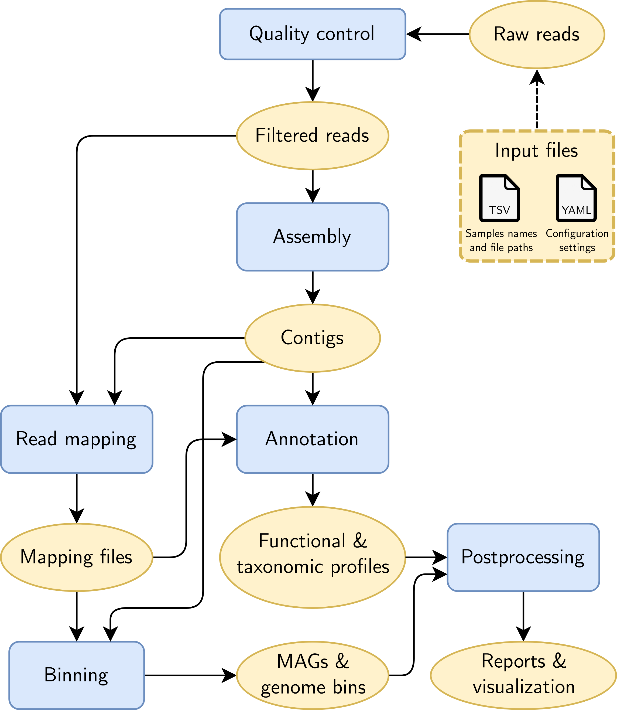

.. Metaphor documentation master file, created by
   sphinx-quickstart on Tue Feb  8 08:44:38 2022.
   You can adapt this file completely to your liking, but it should at least
   contain the root `toctree` directive.

Welcome to Metaphor's documentation!
====================================

Metaphor -- Metagenomic Pipeline for Short Reads -- is a `Snakemake <https://snakemake.readthedocs.io/>`_-based workflow for
assembly and binning of metagenomes. It also performs quality control, and basic functional and taxonomic annotation of the
assembled contigs, using the `NCBI COG <https://www.ncbi.nlm.nih.gov/research/cog/>`_ database.

Metaphor is designed to be lightweight, flexible, and sustainable. That means that it strives to produce the desired output
with the minimal amount of dependencies and overhead, it is suitable for a wide range of use cases, and it is easy to 
maintain and modify. Metagenomic analyses are usually quite complex, with numerous steps and dependencies. Metaphor's goal
is to simplify that, and to provide users with a final output that enables exploratory data analysis and that can be
“plugged” into other downstream pipelines, such as phylogenomics or advanced genome annotation pipelines.

Please refer to this website to learn how to use Metaphor. If you have any questions or comments, or would like to report a
problem, don't hesitate to `open an issue in the GitHub repo <https://github.com/vinisalazar/metaphor/issues/new/choose>`_.
Any and all feedback is appreciated!

If you use Metaphor, please cite the open source software it is based on. The bib files can be found
`here <https://github.com/vinisalazar/metaphor/tree/main/metaphor/workflow/bibs>`_ for your convenience.

**Quickstart**

.. code-block:: console

   $ conda install metaphor -c bioconda -c conda-forge
   $ metaphor execute -i path/to/fastq/

Please read through the `Tutorial <usage/tutorial.md>`_ for an introduction on how to use Metaphor.

This figure shows a graphical summary of how Metaphor works, where blue rectangles are each module (corresponding to an
.smk file), and yellow ovals are data produced at each step.\

**Table of Contents**

.. toctree::
   :maxdepth: 2

   main/tutorial
   main/output
   main/advanced
   main/configuration
   main/troubleshooting
   main/contributing
   main/reference
..
   The following section is commented.

.. Indices and tables
.. ==================

.. * :ref:`genindex`
.. * :ref:`modindex`
.. * :ref:`search`

All code is licensed under MIT for The University of Melbourne. This documentatiom is licensed as Public Domain under `CC0 <https://creativecommons.org/publicdomain/zero/1.0/>`_.
